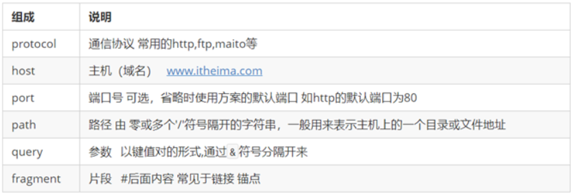
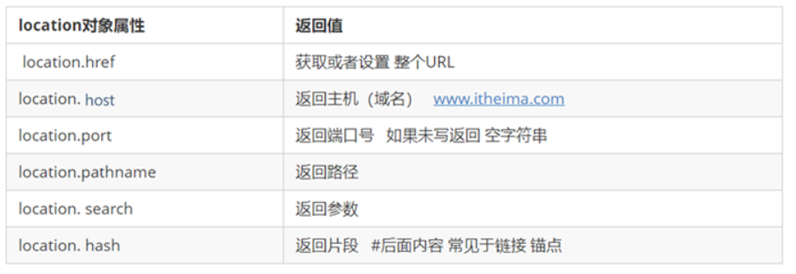

#  WebAPI 第四天

> 目标：

- [ ] 能使用location.href实现页面跳转
- [ ] 能使用localStorage实现本地存储
- [ ] JSON使用
- [ ] 掌握键盘事件类型
- [ ] 完成通过键盘按下发布微博的案例
- [ ] 掌握鼠标移入移出事件类型
- [ ] 排他思想
- [ ] 完成Tab栏切换案例

## 1. window对象的属性

### 1.1 location对象

#### 1.1.1  location 对象概念

- **定义**：location对象是由window对象提供的，通过location对象的属性，管理网页的地址栏（URL）

- **URL**：统一资源定位符（URL）,是互联网上标准资源的地址，互联网上的每个文件都有一个唯一的URL

  ​			它包含的信息指出文件的位置以及浏览器应该怎么处理它

  ​             例如：http://www.itcast.cn/index.html?name=andy&age=10#link

  ​             拆解： protocol : // host [:port]/path/[?query]#fragment



#### 1.1.2 location 对象属性

- 
- 重点掌握**href**
  - 获取当前网页地址：`location.href`
  - 完成页面跳转: location.href = '地址'     
- **案例**  5秒钟之后完成页面跳转

```js
  var num = 5;
  setInterval(function(){
    num--;
    document.body.innerHTML = num;
    if(num == 0){
      location.href = 'http://www.itcast.cn/'
    }
  },1000)
```


### 1.2 本地存储 

随着互联网的快速发展，基于网页的应用越来越普遍，同时也变的越来越复杂，为了满足各种各样的需求，会经常性在本地存储大量的数据，HTML5规范提出了相关解决方案。

#### 1.2.1  本地存储特性

- **数据存储**在用户**浏览器**中
- 设置、读取方便、甚至页面刷新不丢失数据
- 容量较大，**sessionStorage约5M**、**localStorage约20M**
- 只能存储字符串，可以将对象JSON.stringify() 编码后存储
- 都以**键值对**的格式存储在浏览器中

#### 1.2.2  window.sessionStorage

- **生命周期**： 为关闭浏览器窗口
- **数据共享**：在**同一个窗口(页面)**下数据可以共享
- **语法**：
  - 存储数据：`sessionStorage.setItem(key, value)`
  - 获取数据：`sessionStorage.getItem(key)`
  - 删除数据：`sessionStorage.removeItem(key)`
  - 清空数据：(所有都清除掉) `sessionStorage.clear()`

#### 1.2.3  window.localStorage

- **生命周期**：声明周期永久生效，除非手动删除 否则关闭页面也会存在
- **数据共享**：同一个浏览器中打开两个页面是**同源**的，就可以共享localStorage数据
  - 如果两个页面的协议，端口（如果有指定）和主机都相同，则两个页面具有相同的**源**
- **语法：**
  - 存储数据：`localStorage.setItem(key, value)`
  - 获取数据：`localStorage.getItem(key)`
  - 删除数据：`localStorage.removeItem(key)`
  - 清空数据：(所有都清除掉)localStorage.clear()
- **案例**：记住用户名案例

```js
      var remember = document.querySelector('#remember');
      var username = document.querySelector('#username');
      remember.onclick = function(){
        if(this.checked){
          localStorage.setItem('username',username.value);
        }else{
          localStorage.removeItem('username');
        }
      }
      if(localStorage.getItem('username')){
        username.value = localStorage.getItem('username');
        remember.checked = true;
      }
```


### 1.2  JSON

> 目标: 知道什么是JSON、能够写出JSON格式的数据、能够将JSON数据转换成字符串、能够将转换成字符转的JSON格式数据转换回来

**知识点回顾**：

存储相对复杂的数据：

- 数组：var arr = [{name: '小王',age: 26 , tall : '1.60m'},{name: '小李',age: 23 , tall : '1.69m'}]
- 对象：var obj = {group1:['andy','lisa','summer'],group2:['丽丽','甜甜','馨馨']}

弊端：

- 不能本地存储  （在存储时都会将数据进行toString()转换，这样就会破坏原有数据格式）
- 不能传输（后期学AJAX时就知道了）

#### 1.2.1 什么是JSON

- **定义**：[JSON](https://baike.baidu.com/item/JSON)([JavaScript](https://baike.baidu.com/item/JavaScript) Object Notation, JS 对象简谱) 是一种轻量级的**数据交换格式**。它基于 ECMAScript (w3c制定的js规范)的一个子集，采用完全独立于编程语言的文本格式来存储和表示数据
- **大白话**：有一定格式的**字符串**
- **例如**：
  - JSON格式的对象：`var obj = '{"group1":["andy","lisa","summer"],"group2":["丽丽","甜甜","馨馨"]}'`
  - JSON格式的数组：`var arr = '[{"name": "小王","age": 26 , "tall" : "1.60m"},{"name": '小李',"age": 23 , "tall" : "1.69m"}]'`
- **特点**
  - **键必须使用双引号包起来**
  - **字符串也必须是双引号**
  - 只有数字和字符串两种类型
  - 只是记录数据；

#### 1.2.2  **JSON方法**

- **将复杂数据类型数据转换成JSON格式**：`JSON.stringify(对象);`
  - 参数：js数据类型
  - 返回：JSON格式的数据
- **将JSON格式的数据转换为对象**:   `JSON.parse(json格式字符串);`
  - 参数：json格式字符串
  - 返回：js数据类型
  - **注意**：**如果参数不是JSON格式的数据就会报错**

```js
1. 将 var obj = '{"group1":["andy","lisa","summer"],"group2":["丽丽","甜甜","馨馨"]}'`转换成转换成对象
2. 再转换成JSON格式

   var obj = '{"group1":["andy","lisa","summer"],"group2":["丽丽","甜甜","馨馨"]}';
   var obj0 = JSON.parse(obj);
   console.log(JSON.stringify(obj0));
```

## 2. 微博案例优化 

### 2.1 涉及新知识点 --- 常用键盘事件

> 目标：知道键盘按下/抬起事件的语法、知道键盘按下/抬起事件的触发条件、掌握获取按下是键盘中哪个键的方法

* **事件触发条件**
  * keydown：键盘按下之后抬起前，一直触发该事件
  * keyup: 键盘抬起时，触发该事件
* **语法**
  * element.onkeydown = function(){}
  * element.addEventlistener('keydown',function(){})

* **判断按下键盘中的哪个键**
  * **event.keyCode** : 获取按下的键的代表数字（ASCII码）  
  * **关注**：enter键的值是13

```js
1. 给文档添加键盘按下和抬起事件
2. 在事件处理程序中打印按下的是哪个键
document.onkeyup = function(){
   console.log(event.keyCode)
}
```

### 2.2 添加按下enter键发布功能

* **效果**：按下键盘 enter 键能够完成和点击发布按钮一样的事件（发布信息）
* **思路**：
  1. 给文档添加键盘抬起事件
  2. 在抬起事件中判断按下的是否是 enter 键
  3. 是：调用发布按钮绑定的事件处理程序

* **代码**：

  ```js
  // 优化案例---添加按下enter键发布的功能
  // 1. 给文档添加键盘抬起事件
  document.onkeyup = function(){
  // 2. 在事件处理程序中判断当前按下的是否是回车键
      if(event.keyCode == 13 && event.ctrlKey){
  // 3 是：执行原来发布按钮上添加的事件处理程序
          fn();   // 发布按钮添加的事件处理程序
      }
  }
  ```

### 2.3 将数据存储到locastorage中

* **功能**：

​      1. 需要在本地存储里面把以前发布的微博存储起来，当打开页面的时候，把数据读取出来，以ul的形式展示

​      2. 点击发布，可以把文本域里面的内容，发布到ul里面，还要把数据同时存储到本地存储里面

​      3. 按着回车也可以实现发布

​      4. 点击删除

* **思路**：

​      在本地存储里面存储一个微博数据的数组，每一条微博以对象的形式存储起来，本地存储里面只能存字符串——需要使用JSON格式把数组转换为字符串再存储。当打开页面的时候，从本地存储里面把数据读取出来，因为读取出来是字符串，需要转换为js里面的数组才好操作——使用JSON的API转换。得到的以前发布的微博数据——是一个数组

​      得到微博数组之后，遍历这个数组，生成多个li，插入到ul里面

​      实现发布效果

​        点击按钮的时候，获取文本域的内容，创建li，插入ul

​        cotrl+回车实现发布——事件对象里面有一个属性： keyCode 可以识别按下的按键

​      删除——事件委托删除


* **步骤**：

​      效果1：

​        1.从本地存储中把数据读取出来

​        2.把字符串转换为js里面的数组

​        3.遍历数组，生成多个li，插入到ul里面


​      效果2：

​        1. 获取按钮

​        2. 注册点击事件

​        3. 获取文本域的内容，生成li，插入ul

​        4. 需要把新发布的数据，存储到localStorage里面

​            以数组的形式把多条微博数据，存任意localStorage里面

​            需要把数组转换为JSON格式才可以存储

​      效果3：

​        组合按键发布微博

​        1.给文本域注册键盘按下事件

​        2.判断是否同时按下ctrl和回车

​        3.如果是就执行发布的逻辑

​      

​      效果4：

​        删除功能

​        1. 使用事件委托的方式给所有的删除注册事件

​        2. 根据点击的按钮找打对一个li

​        3. 把li从ul里面移除

​        4. 还要把对应的数据从本地删除

​            我们要删除数据，需要根据一个唯一的依据

​            一般会给数据设定一个id属性，保证id属性是唯一的

​              如何保证id是唯一的

​                市面上使用的技术有很多种，有一些随机算法可以实现几乎不会重复的效果,比如：md5

​                我们这么来，我们使用时间戳+随机数的方式 - 后台经常使用的方式

​                  Date.now() + Math.random() * 100000

​            当我们要删除某个数据的时候，就根据id查找，然后删除即可

```js
 function patchZero(v) {
    return v < 10 ? '0' + v : v;
  }

  function formatDate() {
    var now = new Date();
    var y = now.getFullYear();
    var m = now.getMonth() + 1;
    var d = now.getDate();
    var h = now.getHours();
    var mm = now.getMinutes();
    var s = now.getSeconds();
    return y + '-' + patchZero(m) + '-' + patchZero(d) + ' ' + patchZero(h) + ":" + patchZero(mm) + ':' + patchZero(s);
  }
 
  // 2.1 获取元素
  var btn = document.querySelector('.weibo-btn');
  var ul = document.querySelector('.weibo-list');
  var text = document.querySelector('.weibo-text');
  // 定义一个数组，用来存储所有的微博数据
  // var wbData = [];
  // 2.2 注册事件
  btn.onclick = function () {
    // 2.3 获取文本域的内容
    var content = text.value;
    // 2.3.1 获取当前时间  
    var time = formatDate();
    // 生成一个唯一的id
    var id = Date.now() + '' + Math.floor(Math.random() * 10000);
    // 2.6.1 为了让顺序是新发布的在前面，把新的数据，插入到数组的前面
    wbData.unshift({
      id : id,
      content: content,
      time: time
    });
    // 2.4 新建一个li
    var li = document.createElement('li');
    li.innerHTML = '<p class="content">' + content + '</p>' +
      '<span class="del" data-id="'+ id +'">删除</span>' +
      '<em class="time">' + time + '</em>';
    // 2.5 插入到ul的最前面
    ul.insertBefore(li, ul.children[0]);

    // 2.6 把新发布的微博，存储本地存储的数据里面

    
    // 2.6.2 把数组变成JOSN格式的字符串
    var result = JSON.stringify(wbData);
    localStorage.setItem('wbshuju', result);
    // 2.7 把文本域里面的数据情况
    text.value = '';
  }


  // 实现一切发布的微博可以出现在页面的效果
  // 1.1 先把以前发布的微博从本地存储里面获取出来
  var wbShuju = localStorage.getItem('wbshuju');
  // console.log(wbShuju);
  // 1.2 把字符串转换为数组
  var wbData = JSON.parse(wbShuju);
  // 判断一下wbData是不是有数据，如果没有数据，初始化为一个空数组
  if (wbData == null) {
    wbData = [];
  }
  // console.log(wbData);
  // 1.3 遍历数组，生成多个li
  wbData.forEach(function (e, i) {
    // 生成多个li
    var li = document.createElement('li');
    li.innerHTML = '<p class="content">' + e.content + '</p>' +
      '<span class="del" data-id="'+ e.id +'">删除</span>' +
      '<em class="time" >' + e.time + '</em>';
    // 插入到ul的末尾
    ul.appendChild(li);
  });


  // 实现组合键发布
  // 3.1 给文本域注册按键按下事件
  text.onkeydown = function(e){
    // 3.2 判断是否同时按下ctrl和回车
    if(e.ctrlKey && e.keyCode === 13){
      // 获取文本域的内容，发布到微博里面，存储到本地...
      btn.onclick();
    }
  }

  // 实现删除
  // 使用事件委托的方式实现删除的点击
  ul.addEventListener('click',function(e){
    // 判断点击的是否是span
    if(e.target.nodeName === 'SPAN'){
      // 执行删除的逻辑
      var li = e.target.parentNode;
      // 从ul身上把li移除
      ul.removeChild(li);

      // 要把li对应的数据删除掉
      // 根据id删除
      // console.log(wbData);
      // 先得到点击的按钮的id
      // console.log(e.target.dataset.id)
      var delId = e.target.dataset.id;
      // console.log(wbData);
      // 判断数组里面的数据，是否有和我的id是一致的，如果有，就删除掉
      wbData.forEach(function(e,i){
        if(e.id === delId){
          // console.log('找到了要删除的数据');
          // wbData.splice(从哪里开始删除,总共删除多少个)
          wbData.splice(i,1);
        }
      });
      // console.log(wbData);
      // 把新的数组，直接存储到localstorage里面，覆盖掉原来的内容就把删除的数据删掉了
      var result = JSON.stringify(wbData);
      localStorage.setItem('wbshuju',result);
    }
  });
```


## 3. Tab 切换案例

### 3.1 涉及新知识点  ---   鼠标移入移出事件

> 目标：知道鼠标移入移出事件的语法、知道鼠标移入移出事件触发条件

* **事件触发条件**
  * mouseover:  鼠标移入绑定事件的元素的一瞬间触发该事件
  * mouseout: 鼠标移出绑定事件的元素的一瞬间触发该事件

```
1. 创建一个div元素，分别绑定鼠标移入移出事件，测试事件
```

### 3.2 排他思想

> 目标：掌握排他思想的核心、能够使用排他思想完成相关案例

- **核心思想**

1. 所有元素全部清除样式（干掉其他人）

2. 给当前元素设置样式 （留下我自己）

3. 注意顺序不能颠倒，首先干掉其他人，再设置自己

### 3.3 案例分析

* **效果**：

   鼠标移入一个选项  ：1. 当前选项卡选中  2. 跟选中选项卡对应的下方内容显示

* **思路**：
  1. 获取元素：选项、图片；
  2. 注册事件：选项，鼠标移入；
  3. 移入后的变化：
     - 按钮的状态变化：**排他思想**
       - 先把所有的清除选中状态；
       - 给当前元素添加选中状态；
     - 图片的变化：**排他思想**
       - 先把所有图片清除样式；
       - 给当前选项一样的下标的图片，图片的当前样式；

```js
      // 目标1
      // 1. 给所有tab元素添加mouseover事件
      var tabs = document.querySelectorAll('.tab-item');
      // 拿到每一个tab
      for(var i= 0; i<tabs.length;i++){
        // 给tab元素添加序号
        tabs[i].index = i;
        tabs[i].onmouseover = function(){
      // 2. 在事件处理程序中
      // 1> 清除所有元素上的active class属性
            for(var j = 0;j<tabs.length;j++){
              tabs[j].classList.remove('active');
            }
      // 2> 让自己有active class属性
            this.classList.add('active');
      // 目标2  在tab移入事件中
      // 1. 获取所有div元素
            var mains = document.querySelectorAll('.main');
      // 2. 排他思想
      // 1> 将所有div元素上的selected  class属性移除
            for(var j = 0;j< mains.length;j++){
              mains[j].classList.remove('selected');
            }
      // 2> 让移入的tab的下标对应的div元素添加一个selected class属性
            // console.log(this.dataset.index);
            // 通过h5获取自定义属性，获取事件源的下标
            // mains[this.dataset.index].classList.add('selected');
            // 通过事件源获取它的下标
            mains[this.index].classList.add('selected');
            
        }
      }      
```


