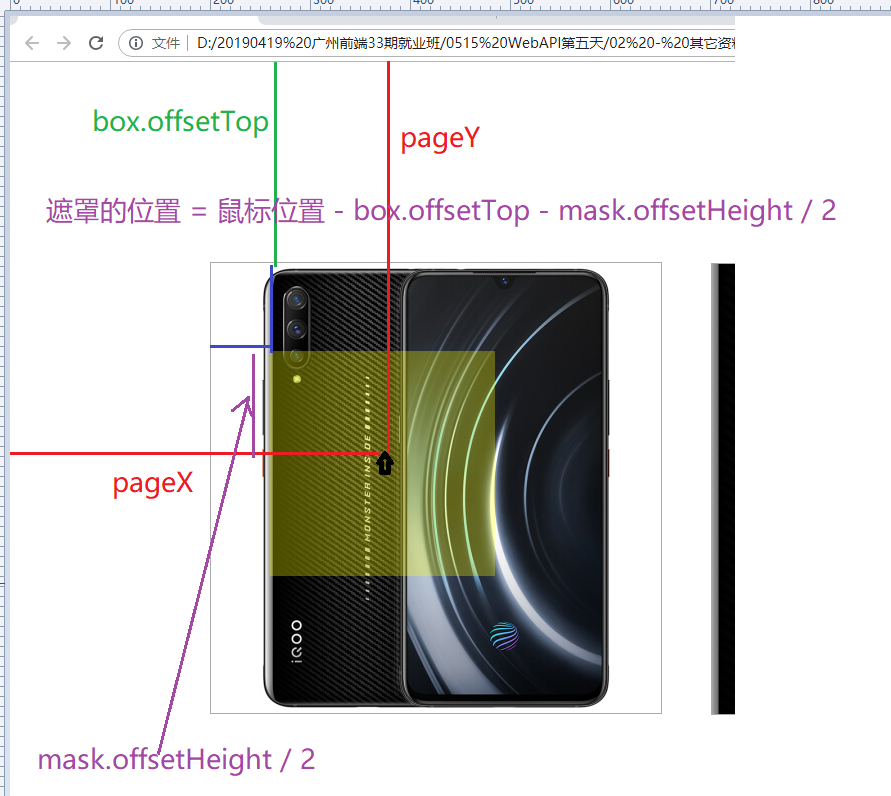

# WebAPI 第五天

> 目标

- [ ] 掌握获取元素宽高度的方法
- [ ] 完成轮播图案例

- [ ] 手风琴案例
- [ ] 点击按钮切换位置
- [ ] 旋转木马
- [ ] 360开机动画
- [ ] 放大镜效果

## 1. 轮播图案例

### 1.1 涉及新知识点 --- 获取元素宽高

> 目标：能够掌握获取元素宽高的方法

- `element.offsetWidth`: 获取元素的宽   （**border+padding+content**）
- `element.offsetHeight`: 获取元素的高   （**border+padding+content**）
- 以上两种方式和 `element.style.width ` \ `element.style.height ` 的区别
  - style方式只能获取写在行内的元素的宽高

```
创建一个div元素，通过class属性设置它的宽高,分别用offset方式和style方式获取
```

### 1.2 案例分析

- 布局：ul下有很多li标签；浮动在一行；
- 原理：切换图片的时候，**修改盒子元素的定位**，给盒子元素的父容器，设置一个 overflow:hidden；
- 功能需求：
  - 序号轮播
  - 左右按钮的轮播
  - 自动轮播
  - 鼠标在轮播图里面的时候，停止自动轮播，离开后继续自动轮播

#### 1.2.1  功能1 ：点击序号轮播

- **核心思想**：**其实就是tab栏**  
- **思路**：

- 获取元素：所有的小圆点序号

- 注册事件：鼠标移入mouseover小圆点的事件

- 移入之后：

  - 小圆点：排他思想实现当前样式出现；
  - 图片切换：计算ul应该向左移动多少，`ul的位置 = 图片宽度 * 索引 * -1`;

- **代码**：

  ```
  for(var i = 0; i < orderBtns.length;i++){
      // 给点击的按钮添加一个index是当前按钮在ul中的位置
      orderBtns[i].index = i;
      orderBtns[i].onclick = function(){
        // 设置当前显示图片的下标
        currentIndex = this.index;
        // 验证是否事件添加成功
        console.log('事件成功');
        // 2. 设置当前点击的序号按钮的样式  设置下方显示的图片
        // 1> 设置当前点击的序号按钮的样式
          // 排他思想
          // 设置所有序号按钮的样式为不选中
            orderFn();
        // 2> 设置下方显示的图片
           // index    left
           // 0       0
           // 1       1*(-730)
           // 2       2*(-730)
           // 3       3*(-730)
           // 设置ul的定位 为  i*(-730)
           ul.style.left = this.index * (-inner.offsetWidth) + 'px';
        
      }
   }
   // 封装设置序号按钮选中的方法
    function orderFn () {
      // 设置所有序号按钮的样式为不选中
      for(var j = 0;j<orderBtns.length;j++){
        orderBtns[j].classList.remove('current');
      }
      // 设置当前选中
      orderBtns[currentIndex].classList.add('current');
    }
  
  ```

  

#### 1.2.2  功能2 ：点击左右按钮轮播 

- **思路**：

  - 创建全局变量 --- 当前显示的图片的下标初始为0
  - 点击序号按钮时，修改当前显示的图片下标为按钮序号
  - 获取左右按钮元素
  - 注册事件：点击click
  - 事件处理程序：
    - 右边按钮
      - 切换图片 （当前显示图片下标++且判断边界    设置ul定位）
      - 设置序号按钮选中 
    - 左边按钮
      - 切换图片 （当前显示图片下标++且判断边界    设置ul定位）
      - 设置序号按钮选中 

- **代码**

  ```
  // 功能2 点击左右按钮轮播图
    // 设置初始显示图片的下标
    var currentIndex = 0;
    // 右边按钮
    // 1. 给右边按钮添加点击事件
    var rightBtn = document.querySelector('.arrow-right');
    rightBtn.onclick = function(){
      // 验证事件是否添加成功
      console.log('事件成功');
      // 2. 在事件处理程序中
      // 1> 切换图片
      currentIndex++;
      if(currentIndex == ul.children.length){
        currentIndex = 0;
      }
      ul.style.left = currentIndex*(-inner.offsetWidth) + 'px';
      // 2> 设置下方序号按钮的选中元素 
      // 排他思想
      orderFn();
    }
  
    // 左边按钮
    // 1. 给左边按钮添加点击事件
    var leftBtn = document.querySelector('.arrow-left');
    leftBtn.onclick = function(){
      // 验证事件是否添加成功
      console.log('事件成功');
      // 2. 在事件处理程序中
      // 1> 切换图片
      currentIndex--;
      if(currentIndex == -1){
        currentIndex = ul.children.length-1;
      }
      ul.style.left = currentIndex*(-inner.offsetWidth) + 'px';
      // 2> 设置下方序号按钮的选中元素 
       // 排他思想
      // 设置所有序号按钮的样式为不选中
      orderFn();
    } 
  
  ```

  

#### 1.2.3  功能3：自动轮播

- **思路**

  - 初始化页面，页面自动向右轮播；
    - 创建一个定时器
    - 定时器：执行向右点击的函数

- **代码**

  ```
  // 功能3 自动轮播
  var timer = setInterval(function(){
  	rightBtn.onclick();
  },2000)
  ```

  

#### 1.2.4  功能4 ：鼠标操作轮播

- **思路**

- 鼠标不在整个盒子上操作时，图片自动向右轮播；

  - 获取元素：整个盒子；
  - 注册事件：鼠标移出；
  - 移出之后：定时器执行向右的函数；（需要把向右的函数提炼为一个函数）
  - 鼠标在盒子上，停止自动轮播
    - 获取元素：整个盒子；
    - 注册事件：鼠标移入；
  - 移入之后：清除定时器；

- **代码**

  ```
  // 功能4 鼠标移入轮播图停止自动轮播，鼠标移出轮播图开启自动轮播
    inner.onmouseover = function(){
      // 清除周期定时器
      clearInterval(timer);
    }
    inner.onmouseout = function(){
      timer = setInterval(function(){
        rightBtn.onclick();
      },2000)
    }
  ```

  

## 2. 案例：手风琴特效

* **效果**
  * 鼠标移入，鼠标当前的图片变宽，其他变小（排他思想）
  * 鼠标移出，所有图片大小恢复原状

* **移入思路**

  * 获取元素：所有的li元素

  - 注册事件：鼠标移入
  - 移入之后：排他
    - 所有的li变为一个值100；
    - 当前单独变为一个值800；

  * 代码

```js
var lis = document.querySelectorAll('#box li');
  for (var i = 0; i < lis.length; i++) {
    // 注册鼠标移入事件
    lis[i].onmouseover = function() {
      // 排他的设置每个li的宽度
      lis.forEach(function(element) {
        element.style.width = 100 + 'px';
      })
      this.style.width = 800 + 'px';
    };

  }
```

* **移出思路**

  * 获取元素：所有的li元素
  * 注册事件：鼠标移出
  * 移出之后：所有的元素回复原来的宽度240

  * 代码

```js
  for (var i = 0; i < lis.length; i++) {
    // 注册鼠标的移出事件
    lis[i].onmouseout = function() {
      // 把所有的li恢复原状
      lis.forEach(function(element) {
        element.style.width = 240 + 'px';
      });
    };

  }
```


## 3. 案例：点击按钮切换位置

- **效果**：点击按钮切换盒子的位置；
- **需知**：**控制盒子的位置和大小的类名为数组；**
- **思路**：
  - 初始化：把数组按照盒子的循环，改变类名；
  - 点击按钮，改变类名数组的位置，重新给盒子循环赋值类名；

```js
  var pos_arr = ["pos_1", "pos_2"];
  var boxs = document.querySelectorAll("p");
  // 初始化
  for (var i = 0; i < boxs.length; i++) {
      boxs[i].className = pos_arr[i];
  }
  
  // 点击切换；
  var btn = document.querySelector("#btn");
  // 点击后，位置发生改变；
  // 实质上为 控制位置类名的数组发生改变；
  btn.onclick = function() {
    // 
    var last = pos_arr.pop();
    pos_arr.unshift(last);

    // console.log(pos_arr);

    for (var i = 0; i < boxs.length; i++) {
      boxs[i].className = pos_arr[i];
    }

  }
```

- 函数优化：

```js
  var pos_arr = ["pos_1", "pos_2"];
  var boxs = document.querySelectorAll("p");

    function change(){
        for (var i = 0; i < boxs.length; i++) {
          boxs[i].className = pos_arr[i];
        }
    }
  // 初始化
  setTimeout(function() {
    change();
  }, 1000);
  
  // 点击切换；
  var btn = document.querySelector("#btn");
  // 点击后，位置发生改变；
  // 实质上为 控制位置类名的数组发生改变；
  btn.onclick = function() {
    // 
    var last = pos_arr.pop();
    pos_arr.unshift(last);

    change();
  }
```

- 特点：HTML结构不变，变的是类名数组；


## 4. 案例：旋转木马

### 4.1**效果**

* 让所有的图片从中间展开
* 点击右边按钮，让图片可以逆时针旋转
* 点击左边按钮，让图片可以顺时针旋转

### 4.2 思路

* **初始化**
  * 初始化布局：给每个li分别设置一个可以控制位置、大小、层级的类名，给类名使用一个数组的方式管理起来，直接按照索引对应的方是设置位置即可；
  * 获取元素：获取所有的li
  * 注册事件：无
  * 初始化：使用循环设置所有的li的大小、位置、层级->只是设置一个已经准备好的类名

```js
var lis = document.querySelectorAll('.slide li');
var pos = ['left1', 'left2', 'middle', 'right2', 'right1'];
// 遍历所有的li，设置类名，就可以发送位置的变化
for (var i = 0; i < lis.length; i++) {
    lis[i].className = pos[i];
}
```

* **左右按钮**
  * 右按钮分析：第一张图
    - HTML结构：没变；
    - 变化的是：类名在数组中的位置；
  * 如何变化：

```js
// 初始化：
// HTML : 1        2         3         4          5
// 位置：'left1', 'left2', 'middle', 'right2', 'right1'


// 右侧点击下：
// HTML :    1        2         3         4          5
// 位置类名：'left2', 'middle', 'right2', 'right1'  'left1',
```

- 实现：
  - 获取元素：左右按钮
  - 注册事件：click
  - 点击之后：
    - **右侧：把第一个类名拿出来，从后添加；**
    - **左侧：把最后一个类名拿出来，从前添加；**

```js
// 初始化再次设置每个li的位置
lis.forEach(function (e, i) {
  e.className = pos[i];
});
// 封装为函数
function rotate() {
  lis.forEach(function (e, i) {
    e.className = pos[i];
  });
}


// 点击右边按钮
var rightBtn = document.querySelector('.next');
// 注册点击事件
rightBtn.onclick = function () {
  // 把位置数组的第一个取出，放到最末尾
  pos.push(pos.shift());
  // 再次把每个li移动
  rotate();
}


// 左侧
leftBtn.onclick = function () {
  // 把位置数组从最后面抽取一个，放到最前面
  pos.unshift(pos.pop());
  rotate();
}
```


## 5. 案例：360开机动画

### 5.1 涉及新知识点 --- transitionend  animationend

- 动画结束事件：专门是指c3里面的动画结束会触发的事件，c3动画有两种，结束动画事件也有两个；
- transitionend：元素的过渡动画结束的时候触发；

```js
var box = document.querySelector('.box');
box.addEventListener('transitionend',function(){
  console.log(123);
});
```

- animationend：会在帧动画结束的时候触发

```js
var box = document.querySelector('.box');
box.addEventListener('animationend',function(){
  console.log(123);
})
```

- 注意：
  - **不能使用on的方式注册，只能使用addEventListener的方式注册**
  - 如果帧动画是无限次的，不会触发该事件animationend

### 5.2  效果

- 分两段**过渡动画**，先让底部的高度逐渐为0，再让整个盒子的宽度为0；

### 5.3 实现

- 获取元素：盒子底部，整体盒子
- 注册事件：盒子底部 transitionend
- 过度完成：设置整体盒子width

```js
closeButton.onclick = function() {
    // 把下半部分的高度设置为0
    bottomPart.style.height = 0;
}


var box = document.querySelector("#box");
bottomPart.addEventListener('transitionend',function(){
  // 把box盒子的宽度修改为0
  box.style.width = 0;
});
```


## 6. 案例：放大镜效果

### 6.1 涉及知识点 --- 获取元素相对父级的坐标

* **获取元素的相对父级**：`element.offsetParent`  

  (设置position：relative的最近父级元素，如果没有则以body为相对父级)

* **获取元素相对于相对父级元素的垂直距离**：`element.offsetTop `
* **获取元素相对于相对父级元素的水平距离**：`element.offsetLeft   `

### 6.2 案例

#### 6.2.1  效果

- 鼠标移入，出现黄色的遮罩，和用来放大的盒子
- 鼠标移出，遮罩和放大的盒子消失
- 鼠标在小图片上面进行移动的时候
  - 黄色遮罩层会随着鼠标一起移动
  - 用来放大显示的图片，也跟着一起移动

#### 6.2.2  思路

* **移入移出**
  * 获取元素(box,遮罩，放大用的盒子)
  * 注册事件：移入移出
  * 之后：遮罩和放大盒子显示和隐藏

```js
//2 注册鼠标的移入和移出事件
box.onmouseover = function(){
  // 3 控制遮罩和放大的盒子显示
  mask.style.display = 'block';
  big.style.display = 'block';
}
box.onmouseout = function(){
  // 3 控制遮罩和放大的盒子隐藏
  mask.style.display = 'none';
  big.style.display = 'none';
}
```

* **遮照随鼠标移动**
  * 获取元素：small图
  * 注册事件：mousemove
  * 移动之后：鼠标的位置计算出遮罩应该在位置，设置给遮罩；
    - 应该在的位置：遮罩的位置 = 鼠标的位置 - box的位置 - mask的宽高的一半



```js
small.onmousemove = function(e){
  // 根据鼠标的位置，计算出遮罩应该在哪个位置
  var mx = e.pageX;
  var my = e.pageY;
  
  // 5 遮罩在盒子内的位置 = 鼠标位置 - box的位置 - 遮罩宽高的一半
  var x = mx  - mask.offsetWidth / 2;
  var y = my  - mask.offsetHeight / 2;

  // 7 设置给mask
  mask.style.top = y + 'px';
  mask.style.left = x + 'px';
}
```

- **范围问题**：遮罩只能在small里面移动；最小值和最大值
  - 最小值：0；如果遮罩的位置小于0了，强行设置为0；
  - 最大值： small的宽高 - mask的宽高；遮罩的位置大于最大值了，强行设置为最大值；

```js
small.onmousemove = function(e){
  // 4 根据鼠标的位置，计算出遮罩应该在哪个位置
  var mx = e.pageX;
  var my = e.pageY;
  
  // 5 遮罩的位置 = 鼠标位置 - box的位置 - 遮罩宽高的一半
  var x = mx - box.offsetLeft - mask.offsetWidth / 2;
  var y = my - box.offsetTop - mask.offsetHeight / 2;
  
  // 6 不让遮罩超出边界,最小值0
  x = x < 0 ? 0 : x;
  y = y < 0 ? 0 : y;
    
   
  // 算出mask移动的最大距离
  var maxX = small.offsetWidth - mask.offsetWidth;
  var maxY = small.offsetHeight - mask.offsetHeight;
  x = x > maxX ? maxX : x;
  y = y > maxY ? maxY : y;
    
  // 7 设置给mask
  mask.style.top = y + 'px';
  mask.style.left = x + 'px';
}
```

- **offset属性总结**：

```js
  元素.offsetTop - 得到元素距离它的offsetParent的垂直距离
  元素.offsetLeft - 得到元素距离它的offsetParent的水平距离
  元素.offsetParent - 得到一个距离我最近的定位的前代元素，如果我的前代元素都没有定位，得到body或者html
  元素.offsetWidth - 元素的实际宽度 = border+padding+width
  元素.offsetHeight - 元素的实际高度 = border+padding+height
```

* **放大效果**
  * 获取元素：大图片
  * 注册事件：小图片移动
  * 移动之后：鼠标的位置计算出大图应该在的位置，设置给大图
    - 移动比例：
      - 我在小图上移动从左到右，移动了`small.offsetWidth - mask.offsetWidth`，
      - 按照道理大图应该移动 `bigImg.offsetWidth - big.offsetWidth`；

```js
(small.offsetWidth - mask.offsetWidth)/(bigImg.offsetWidth - big.offsetWidth) 
= 
y/big_y
```

- 计算大图应该移动的位置：

```js
var bigImgX = x * bigImgMaxX / maxX;
var bigImgY = y * bigImgMaxY / maxY;
```

- 设置：

```js
// 10 设置给大图,注意方向是相反的
bigImg.style.top = -bigImgY + 'px';
bigImg.style.left = -bigImgX + 'px';
```

- `bigImg.offsetWidth - big.offsetWidth`：
  - offsetWidth包括：content+padding+border；border不应该计算在内；原因：小遮照覆盖的范围是自己的offsetWidth(border+padding+width)
  - 大遮照显示的范围应该是盒子的视图宽度，不包括border值；获取盒子的视图宽高： 包括padding + content 

```js
元素.clientWidth - 可视区域的宽度
元素.clientHeight - 可视区域的高度

(small.offsetWidth - mask.offsetWidth)/(bigImg.offsetWidth - big.clientWidth) 
= 
y/big_y
```

